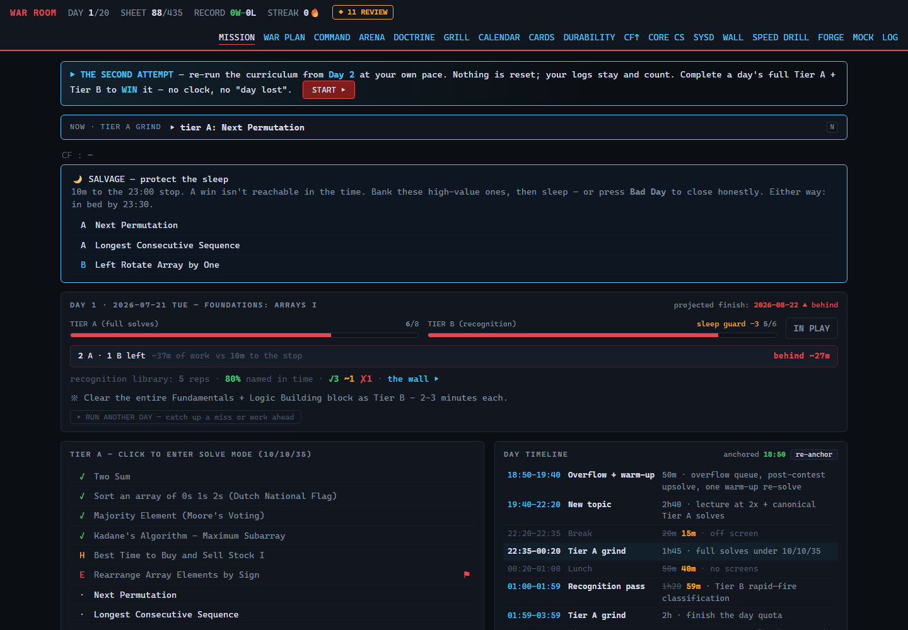
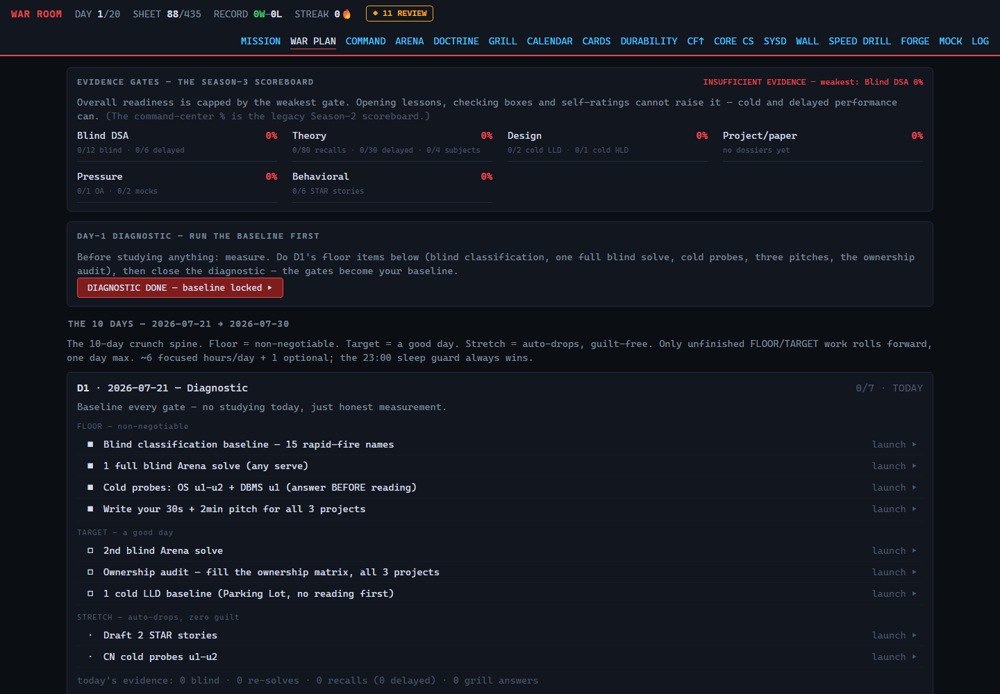
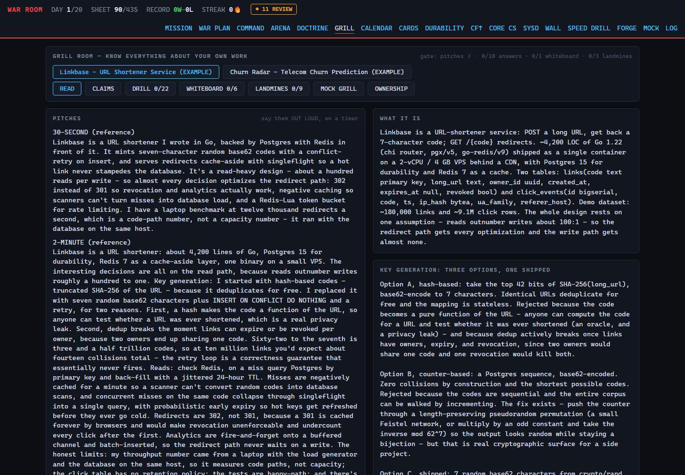
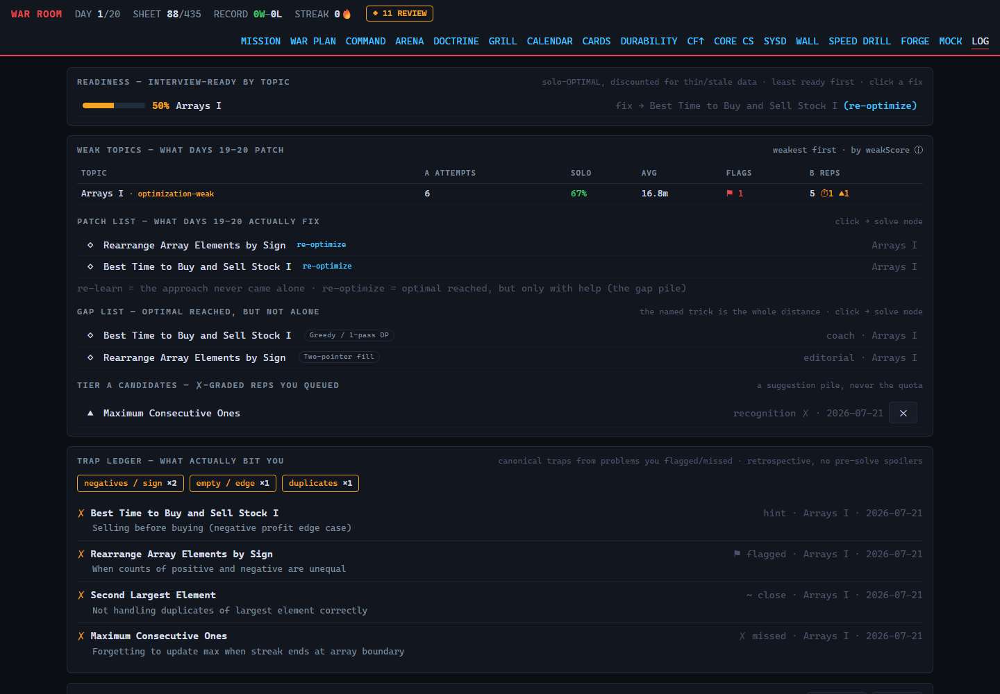
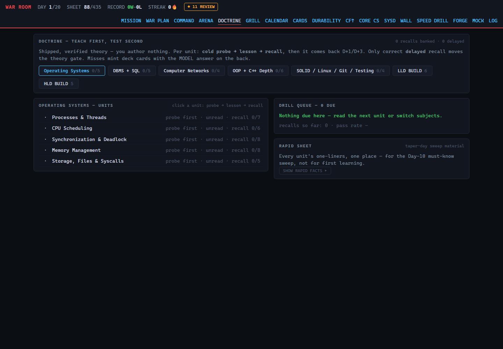
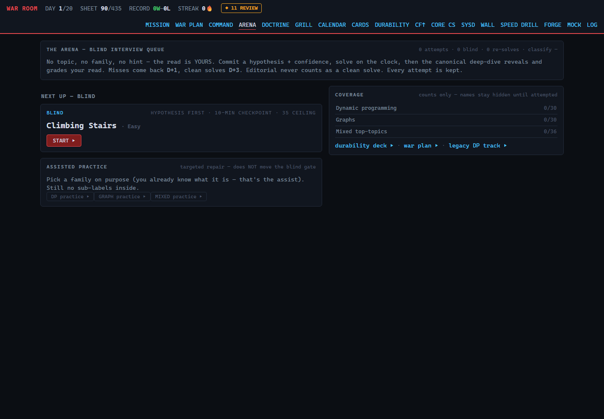
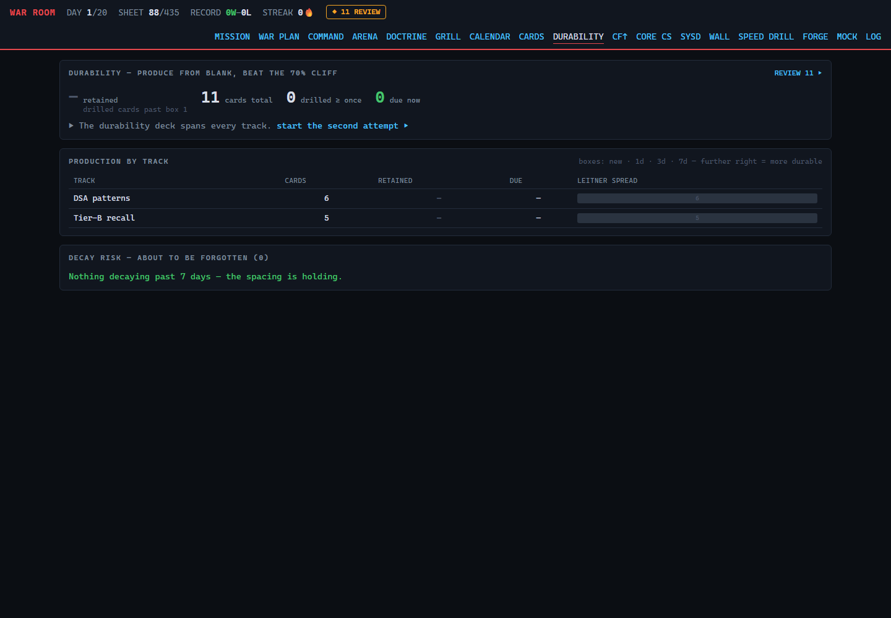

# PROJECT WAR ROOM

**A local-first training ground for coding interviews.** Not a checklist app — a referee. It puts a clock on you, refuses to let you fool yourself, and keeps a permanent record of what you can actually do unaided.

```
npm start   →   http://localhost:4350
```

**Zero dependencies. No `npm install`, no build step, no database, no account, no cloud.** One Node file serves the app; everything you do is readable JSON in `./data` on your own machine.

> **Want it online instead?** An optional **cloud mode** deploys the whole thing to Netlify with Google sign-in and per-user progress saved to Firebase — so you can train from any device, and share the URL with others. Local mode stays the default and loses nothing. See **[Deploy to the web](#deploy-to-the-web-optional)**.



---

## First, the thing this is built on

### What the sheet is

**DSA** — Data Structures and Algorithms — is the body of material coding interviews test: arrays, sorting, searching, trees, graphs, dynamic programming.

A **sheet** is a curated, ordered list of practice problems meant to cover that whole body. This app is built around the **[Striver A2Z / TUF+ sheet](https://takeuforward.org/)** — **435 problems across 20 topics**, the most widely used sheet for placement prep in India. The app indexes every problem by name, topic and sheet section, and links out to takeuforward.

> The sheet is **not mine** — it belongs to [takeuforward (Striver)](https://takeuforward.org/). This is an unofficial companion tracker. See [Credits](#credits--licence).

### Tier A vs Tier B — the core idea

This is the single most important concept in the app. Everything else follows from it.

**The problem:** 435 problems at 35 minutes each is over 200 hours. Nobody has that before an interview.

**The insight:** not every problem carries a new idea. Many are variations on a technique you already met. Grinding all 435 at full depth burns most of your time re-proving things you can already do.

**So every problem is assigned a tier:**

|  | **TIER A — depth** | **TIER B — coverage** |
|---|---|---|
| **How many** | **123 problems** | **335 problems** |
| **Why** | Each teaches a genuinely new mental move | Variations — you only need to *recognise* them |
| **What you do** | **Write real, working code.** Timed. | **Read it, name the technique, sketch 3–5 lines. No coding.** |
| **Time budget** | **10 / 10 / 35 minutes** | 7-minute ceiling, 2-minute classify timer |
| **Before the clock starts** | Type your guess at the pattern — **it will not start until you do** | Same: name it before you reveal |
| **How it ends** | A pattern card you write yourself | The rep *is* the card |

**"10 / 10 / 35" means:**

- **First 10 minutes — completely alone.** No hints, no editorial, nothing.
- **At minute 10 — a checkpoint you cannot dismiss.** *"Do you have ANY working approach? A brute-force one counts."* Three honest answers: keep going · read the approach · ask the Coach. Either of the last two permanently records the solve as **hint-assisted**. That's a record, not a punishment.
- **At minute 35 — a hard ceiling.** An alarm, and exactly two options: **solved**, or **read the full solution**. There is no "just five more minutes". If you read it, you then close it and **rebuild the whole thing from a blank file in 15 minutes** — because reading a solution teaches you almost nothing and reproducing it teaches you almost everything.

**Tier B is not "the easy list."** It's a different exercise: two minutes to say *"this is a two-pointer problem"* and sketch the loop. If you can, coding it is mechanical and you don't need the practice. If you can't, the app promotes it to Tier A for a full solve.

**The anti-spoiler rule:** the app knows every problem's pattern and will **never show you** on any list, menu or preview. It's revealed only after you commit to an answer. Naming it yourself is the skill being trained — a spoiled problem is a wasted problem.

### A few more terms

| Term | Meaning |
|---|---|
| **Pattern** | The *technique* a problem needs — "sliding window", "binary search on the answer". Recognising *which* one applies is a harder, separate skill from coding it, and it's what interviews actually test. |
| **Trigger** | The phrase in the statement that should have made the pattern fire. |
| **Editorial** | The official written solution. Reading it is allowed — but it costs you, and it's recorded. |
| **⚑ Flag** | This problem beat you. Queued for revision. |
| **◇ Gap** | You reached the optimal solution — but only with help. One named trick away from ready. The cheapest wins available to you. |
| **Solo rate** | How often you solve completely unaided. **The number that predicts interview performance.** |

### What counts toward 435

`SHEET n/435` = problems you'd already done before starting + every distinct problem you genuinely touched. Deliberately **excluded**: problems you abandoned, re-solves of ones already counted, contest upsolves, and 23 supplement problems (worth solving, not on the sheet).

---

## Then, everything else interviews test

DSA is the biggest slice, not the whole exam. The rest of the app covers what the sheet doesn't:

| | What it does |
|---|---|
| **The Arena** | **96 problems served completely blind** — no topic label, no grouping, no hint, in an order designed to leak nothing. The closest thing here to a real interview. Solve it right *and* read it right → it returns in 3 days; anything else → tomorrow. |
| **Spaced repetition** | Every card you write enters a **1 / 3 / 7-day** ladder. Reviews are *produce-from-blank*, not recognise-from-a-list. The dashboard shows what's decaying, and its "retained %" counts only cards actually re-tested — so it can't be inflated by doing more new work. |
| **Doctrine** | Core CS: **24 units, 160 fact-checked questions** across OS, DBMS + SQL, Networks, OOP + C++, and SOLID/Linux/Git/Testing. Each unit runs cold probe → lesson → recall from blank → the same questions again at +1 and +3 days. |
| **System design** | **11 worked modules** (Parking Lot, LRU Cache, Rate Limiter, URL Shortener, Chat System, News Feed…). Credit comes only from a **cold build** — writing the design without opening the answer first. Then the app plays interviewer: a change request, and a failure injection. |
| **Grill Room** | Because *"tell me about your project"* sinks more candidates than any algorithm. You write a dossier; the app attacks it — claims vs evidence, derivations you must do unaided, the landmine questions, and *"what did **you** personally do?"* Ships with two worked example dossiers. |
| **Interview simulation** | A **90-minute OA simulator** whose clock does not pause and survives a refresh (real assessments don't pause either), plus a **5-round mock interview** where you type what you would *say*, not code — then replays your actual words back at you. |
| **Evidence gates** | The scoreboard that matters. Six gates; your readiness equals your **weakest** one, not the average. **Nothing you can click raises them** — not reading a lesson, not ticking a box, not rating yourself highly. Only measured cold performance after a real delay. |

<details>
<summary><b>Screenshots</b> — evidence gates, the Grill Room, weak-topic analysis, and more</summary>

### Evidence gates — the scoreboard that can't be gamed


### The Grill Room — defend your own projects


### The Data Room — what's actually weak


### Doctrine — core CS, produced from blank


### The Arena — problems served blind


### Durability — what you're forgetting


*(All screenshots are from `npm run demo`, which uses fictional data.)*

</details>

---

## Why it works this way

Most tools track **what you touched**. Almost none track **what you can still do a week later, alone, under a clock, without recognising the problem from last time.** That gap is where interviews are lost. Every mechanic here attacks one specific way people fool themselves:

| The lie | The answer |
|---|---|
| *"I understood it"* — after reading a solution | The only way out is to close the editorial and rebuild from a blank file, then write a card in your own words. |
| *"I solved it"* — after 90 minutes and three hints | Hard 35-minute ceiling. Every hint recorded. Your headline number is the *solo* rate. |
| *"I know this pattern"* — because you saw the topic heading | The Arena serves problems with no topic label. |
| *"I revised it"* — by re-reading notes | Reviews are produce-from-blank. Re-reading scores nothing. |
| *"I'm ready"* — based on feeling ready | Six evidence gates. Nothing you can click moves them. |

If you want an app that congratulates you, this is the wrong one.

---

## Install and run

**Requirements:** [Node.js](https://nodejs.org) **18.17 or newer**. Nothing else — no packages, no internet needed after cloning.

```bash
git clone https://github.com/Madhvansh/project-war-room.git
cd project-war-room
npm start
```

Open **<http://localhost:4350>**. On first run it creates `data/config.json` and sets **day 1 = today**. That's the whole setup.

> Check with `node --version`. Below `v18.17`, update Node first.

### Try the demo before committing

```bash
npm run demo
```

A **throwaway copy** on <http://localhost:4399>, pre-loaded with a realistic mid-grind day. Your real data is never touched — it writes only to `./data-demo`. Add **`?speed=60`** to the URL and one real second becomes one minute, so you can watch the full 35-minute ritual play out in about half a minute. Delete `./data-demo` to reset.

### Make it yours

Your settings live in `data/config.json` — created on first boot, **never committed**. Edit it directly or:

```bash
npm run setup                                  # show current settings
npm run setup -- --start 2026-08-07            # day 1 of your 20-day plan
npm run setup -- --name "Alex" --baseline 40   # your name + problems already done
npm run setup -- --cf tourist                  # Codeforces handle (omit to keep it off)
```

`start_date` re-bases the whole plan **in memory** — the shipped files are never rewritten, so `git pull` never conflicts with your setup. Set `baseline_done` to the problems you'd already solved, so the counter reflects reality.

**Not ready for a 20-day plan?** Ignore the calendar entirely — the Arena, Doctrine, the review deck and the Grill Room are all self-paced.

---

## Deploy to the web (optional)

Local mode is the default and the fullest version. But if you'd rather run WAR ROOM as a hosted site — reachable from your phone, your laptop, and anyone you give the link to — there's an optional **cloud mode**: a static build on **Netlify** with **Google sign-in** and each person's record saved to **Firebase Firestore**.

```
your-site.netlify.app  →  sign in with Google  →  your own saved war room
```

- **One record per user.** Everyone who signs in gets their own private progress, gated by Firestore security rules — nobody can see anyone else's.
- **Any device.** Start a solve on your laptop, check the review deck on your phone; it's the same account.
- **Free.** Firebase's Spark plan and Netlify's free tier cover it comfortably.
- **Set-your-own-dates in the app.** A **⚙ Settings** panel replaces `data/config.json` — name, start date, baseline, timezone, Codeforces handle.
- **Costs you the Coach.** The AI Coach, mock interviewer and card enrichment need the local `claude` CLI, which can't run on static hosting — in cloud mode they show a clear "local-only" message. **Every solve, card and evidence gate works fully; the gates never used AI anyway.**

Nothing about local mode changes: leave Firebase unconfigured and `npm start` behaves exactly as it always has. The whole toggle is one file, [`public/firebase-config.js`](public/firebase-config.js).

**→ Full step-by-step: [DEPLOY.md](DEPLOY.md)** (Firebase project, auth, rules, Netlify env vars — about ten minutes).

---

## Good to know

**Your data is yours.** Everything is readable JSON in `./data` — no account, no telemetry, no network calls except an optional Codeforces rating sync. `data/` is gitignored, so forking this repo never carries your record with it. Backing up = copying the folder. *(In cloud mode the same JSON lives in your Firebase project instead — `users/{uid}/warroom/*` — equally readable and exportable from the Firestore console.)*

**Two files are private by design:** `data/` (everything you do) and `grill.s3.json` (your project dossiers — a candid account of your own work). Both are gitignored.

**The AI coach is optional.** Six features can use the local [`claude` CLI](https://claude.com/claude-code) for Socratic hints and a mock interviewer. **No API key is ever used** — the server strips `ANTHROPIC_*` from the child environment. Without the CLI, those six controls fail fast with a clear message and *everything else works*. All six evidence gates are computed with zero AI input.

> **⚠ Security.** The API has **no authentication**, so the server listens on `127.0.0.1` only by default. `P435_HOST=0.0.0.0` opens it to your phone on the same Wi-Fi — **only do that on a network you trust.** Never on campus, café, hotel or airport Wi-Fi: anyone there could read, change or wipe your record.

---

## Full documentation

This README is the short version. **[ADDITIONAL_INFORMATION.md](ADDITIONAL_INFORMATION.md)** has everything else:

- **[The full feature tour](ADDITIONAL_INFORMATION.md#the-full-feature-tour)** — every view and how to use it, grouped by what you're trying to do
- **[Keyboard shortcuts](ADDITIONAL_INFORMATION.md#keyboard-shortcuts)** — the complete table
- **[How a day works](ADDITIONAL_INFORMATION.md#how-a-day-works)** — blocks, quotas, the sleep guard, overflow, sealing
- **[The three seasons](ADDITIONAL_INFORMATION.md#the-three-seasons)** — the sprint, self-paced prep, the final crunch
- **[Configuration](ADDITIONAL_INFORMATION.md#configuration)** — env vars, URL flags, content files
- **[Scripts](ADDITIONAL_INFORMATION.md#scripts)** — including which ones can destroy data
- **[Troubleshooting](ADDITIONAL_INFORMATION.md#troubleshooting)** and **[Security](ADDITIONAL_INFORMATION.md#security)** in full

Also in `docs/`: a [2-week core-CS + system-design sprint guide](docs/INTERVIEW-SPRINT-GUIDE.md), and the [sheet-section → plan-day map](docs/SHEET_MAP.md).

---

## Contributing

Keep the constraints: **no runtime dependencies, no build step to run the app**, everything readable, and `npm test` green (116 assertions over the rules engine — the browser and the tests import the same file). If you change plan structure or rules, update the audit in the same commit. *(The optional cloud build in `scripts/netlify-build.mjs` only copies files and reads env vars — it adds no dependency and local mode never runs it.)*

---

## Credits & licence

**The problem set is not mine.** The A2Z / TUF+ sheet — its selection, ordering and editorial content — belongs to **[takeuforward.org (Striver)](https://takeuforward.org/)**. This is an unofficial, independent companion tracker with no affiliation or endorsement. `problems.json` stores only problem names, topics, sheet sections and links; the trigger/pattern/trap notes are LLM-generated study commentary offered in good faith, not authoritative course content. Some linked problems need a TUF+ account, and a few Arena items are LeetCode Premium. The Codeforces ladder references the **TLE Eliminators CP-31** sheet.

**If this tool is useful to you, go support the people who made the actual curriculum.**

Built by **Madhvansh**. Released under the [MIT Licence](LICENSE).

---

*Now go be honest with yourself for twenty days.*
